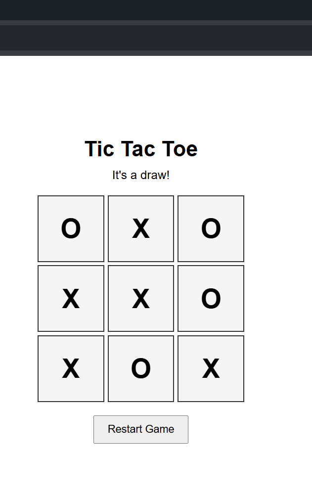
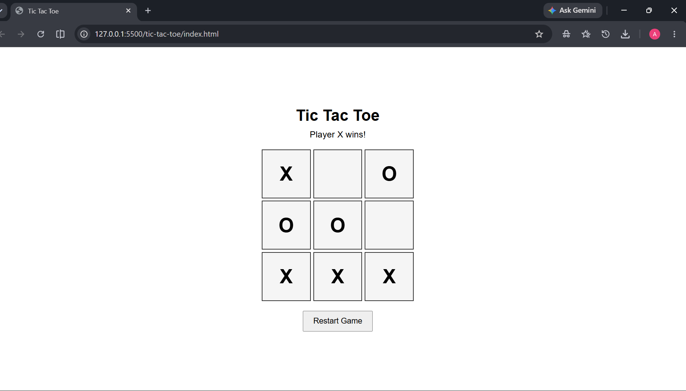

# Tic Tac Toe Game

A simple two-player Tic Tac Toe game developed using HTML, CSS, and JavaScript.

## Project Overview

This project is a browser-based Tic Tac Toe game for two players. Players take turns placing X and O on a 3×3 game board. The game automatically detects a winner or a draw.

## Features

* Two-player gameplay
* 3×3 game board
* Automatic winner detection
* Draw detection
* Prevents players from selecting an occupied cell
* Restart game functionality
* Responsive basic interface

## Technologies Used

* HTML5
* CSS3
* JavaScript
* Git
* GitHub

## Project Structure

```text
01-tic-tac-toe/
│
├── README.md
├── index.html
├── style.css
└── script.js
```

## Screenshot





## How to Run

1. Download or clone this repository.
2. Open the `01-tic-tac-toe` folder.
3. Open `index.html` in a web browser.

For development, the project can also be opened using the Live Server extension in Visual Studio Code.

## How the Game Works

The JavaScript program maintains the current game state in an array.

Each move:

1. Checks whether the selected cell is available.
2. Places the current player's symbol.
3. Checks all possible winning combinations.
4. Determines whether the game has been won or drawn.
5. Switches the turn to the other player.

## Future Improvements

* Add score tracking
* Add single-player mode
* Add computer AI
* Improve mobile responsiveness
* Add game animations

## Author

**Abhishek Kumar**

B.Tech Computer Science Engineering
